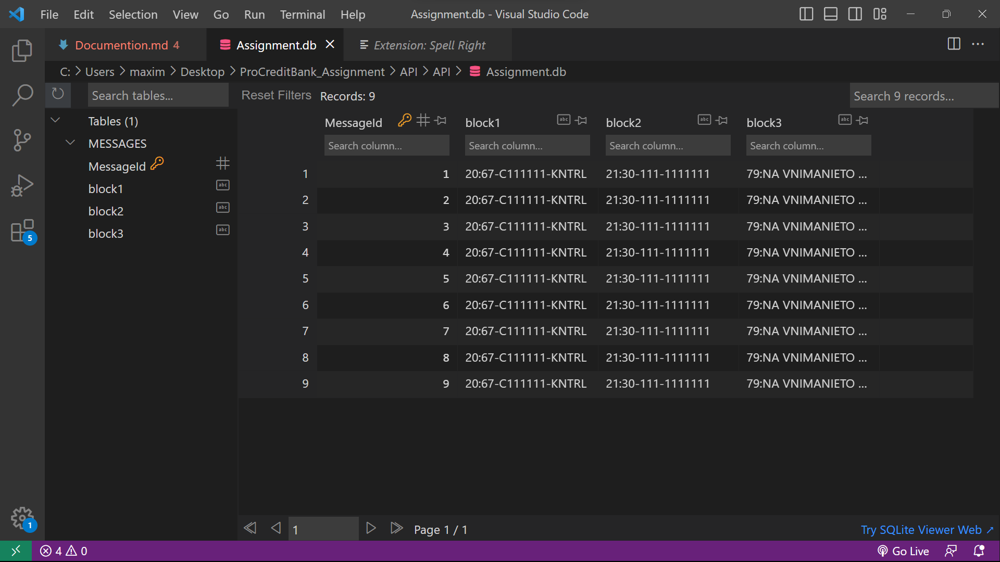
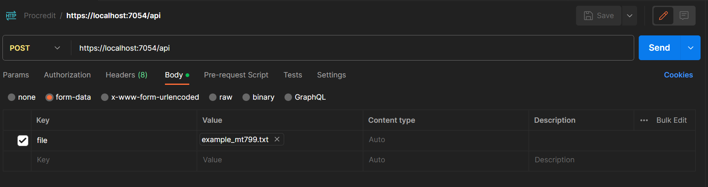
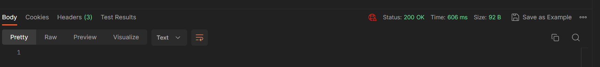
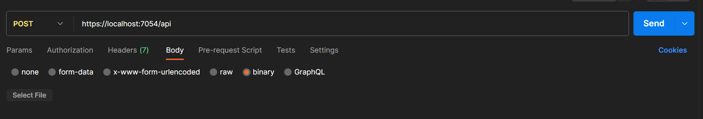
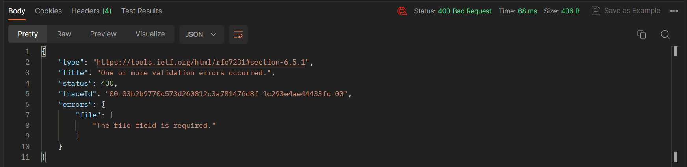

# Swift API

## Basic functions
The API can accept a POST request containing a file. The format of the file isn't relevant but it has to be structured in the Swift MT799 message format. Then the file's contents are broken into three blocks and stored in a local database.
## How the API is structured
The solution has two projects: the DataAccess and the API. 
1. The DataAccess project has the model of the database and the context class for configuring the link from the API to the database. The System.Data.SQLite NuGet package is used to connect to the database. Furthermore, in the `appsettings.json` in the API project the database directory and name are specified.  

    ### The table for the messages:
  
    |    Id    | Block 1  | Block 2  | Block 3  |
    | -------- | -------- | -------- | -------- |
    |   Id 1   | Block 1  | Block 2  |  Block 3 |
    |   Id 2   | Block 1  | Block 2  |  Block 3 |


    ### The database in Visual Studio Code with the SQLite Viewer extension
    
    


2. The API project is where the app is configuring the services for the database and another NuGet package `Serilog` which handles the logging for errors.
  
    ``` builder.Services.AddControllers();builder.Services.AddScoped<DatabaseContext>(); 
    builder.Host.UseSerilog((context, configuration) => configuration.ReadFrom.Configuration(context.Configuration)); 

3.  This project also contains the controller for the API which can accept two HTTP requests:
    1. An empty GET request  
        ```[HttpGet] 
        public async Task<IActionResult> Get()
        {
            return Ok();
        }
    
    2. A POST request for accepting and formatting a file. Additionally it catches errors in runtime and saves them in a file in the `logs` folder
        ```[HttpPost]
        public async Task<IActionResult> Upload(IFormFile file)
        {
            try
            {
                ...
            }    
            catch (Exception ex)
            {
                logger.LogError(ex, ex.Message);
                return BadRequest();
            }
        }

4. In the `appsetting.json` file the `Serilog` file destination is configured 

    ``` 
    "WriteTo": [
      {
        "Name": "File",
        "Args": {
          "path": "logs/log.txt",
          "rollOnFileSizeLimit": true,
          "formatter": "Serilog.Formatting.Compact.CompactJsonFormatter,Serilog.Formatting.Compact",
          "rollingInterval": "Day"
        }
      }
    ]

## How to use (Postman)

It is recommended to use Postman or ARC or another software for sending HTTP requests to the API.

- The correct way of formatting a post request with the URL and a correct body 

    

    And the response with code 200 

    
    

- A bad request (in this case without body)
    
    

    And the reponse with code 400 

    
    

